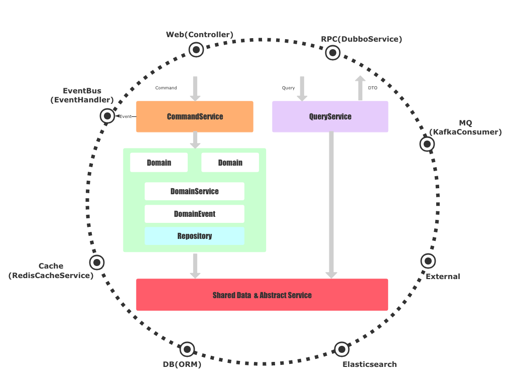
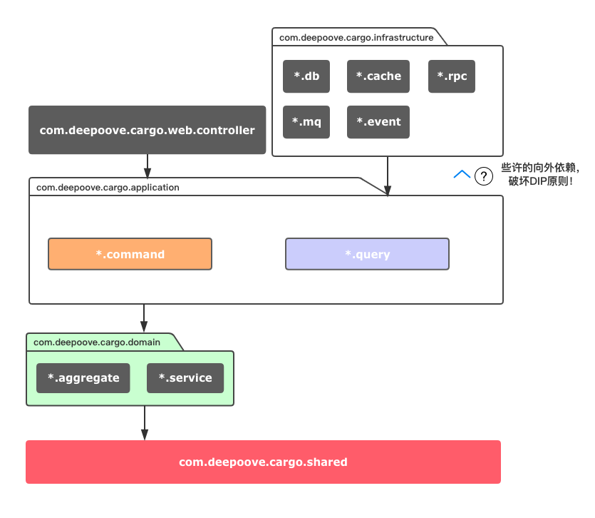
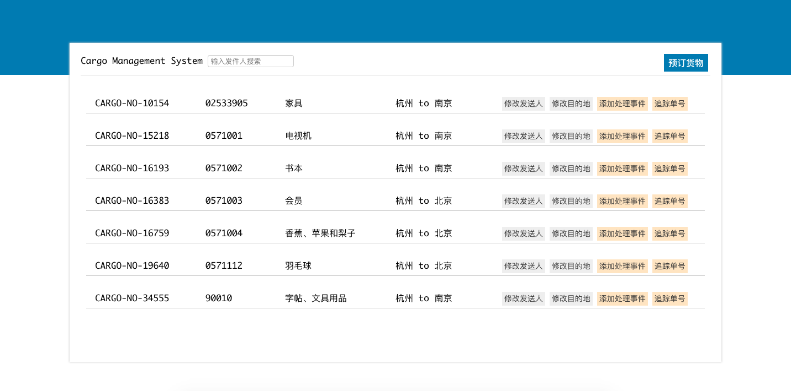
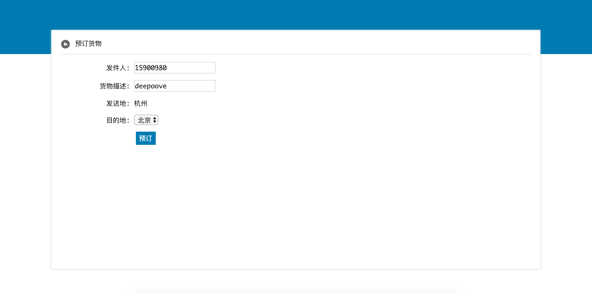
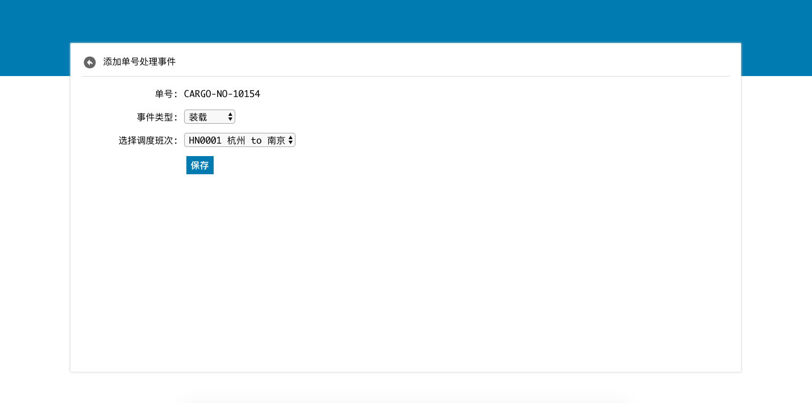
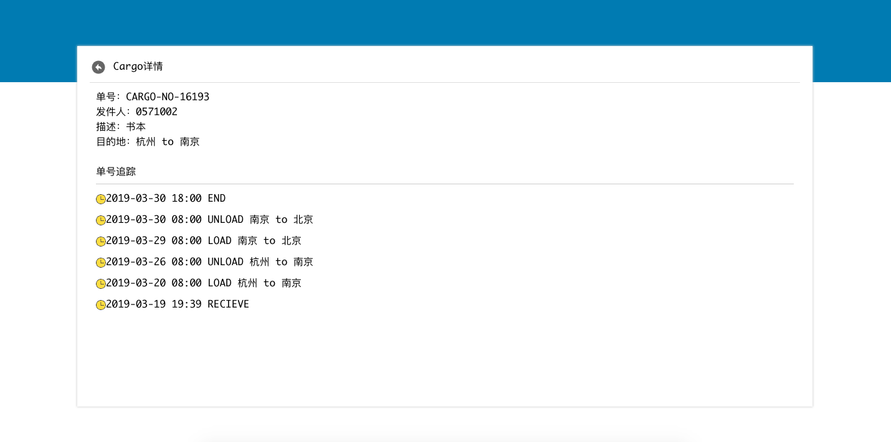

## ddd-cargo
领域驱动货物需求示例

### 需求-节选自《领域驱动设计第7章》
假设我们正在为一家货运公司开发新的软件，最初的需求包括三项基本功能：
1. 事先预约货物
2. 跟踪客户货物的主要处理流程
3. 当货物到达其处理过程中的某个位置时，自动向客户寄送发票

### DDD、CQRS架构图

### DDD、CQRS代码结构

### 示例
ddd-cargo-example是一个单Maven模块的项目，DDD+CQRS落地示例，基于SpringBoot开发。

下面我们以ddd-cargo-example为例来演示如何落地：

1. 修改`/ddd-cargo-example/src/main/resources/application.properties`数据库连接

2. 初始化数据库脚本文件`/ddd-cargo-example/mysql_init.sql`

3. 运行`/ddd-cargo-example/src/main/java/com/deepoove/cargo/CargoApplication.java`

4. 浏览器访问`http://127.0.0.1:8077/index.html`

#### 查询Cargo

#### 预订Cargo

#### Cargo事件

#### 追踪Cargo

### 相关资料
[The Clean Architecture](https://blog.cleancoder.com/uncle-bob/2012/08/13/the-clean-architecture.html)  
[DDD, Hexagonal, Onion, Clean, CQRS](https://herbertograca.com/2017/11/16/explicit-architecture-01-ddd-hexagonal-onion-clean-cqrs-how-i-put-it-all-together/)  
《领域驱动设计》  
《实现领域驱动设计》  
[dddsample-core](https://github.com/citerus/dddsample-core)  
